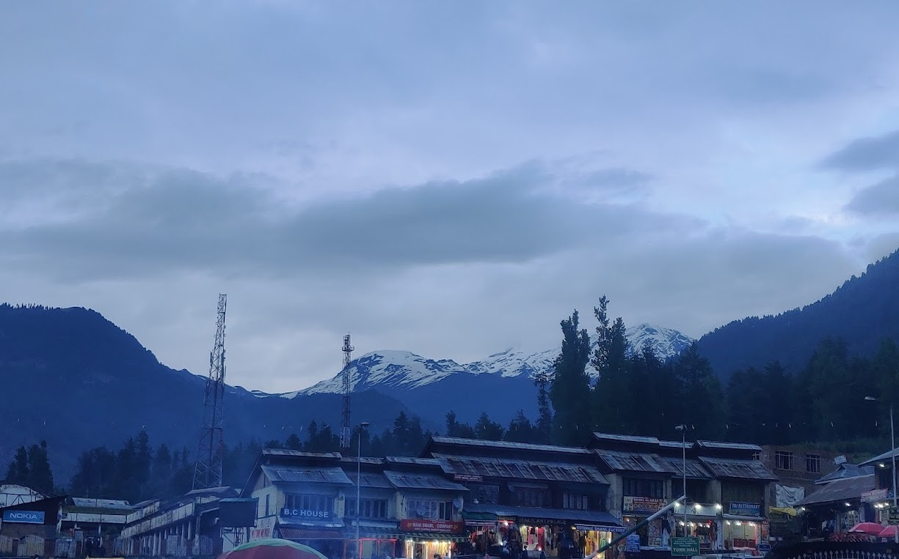
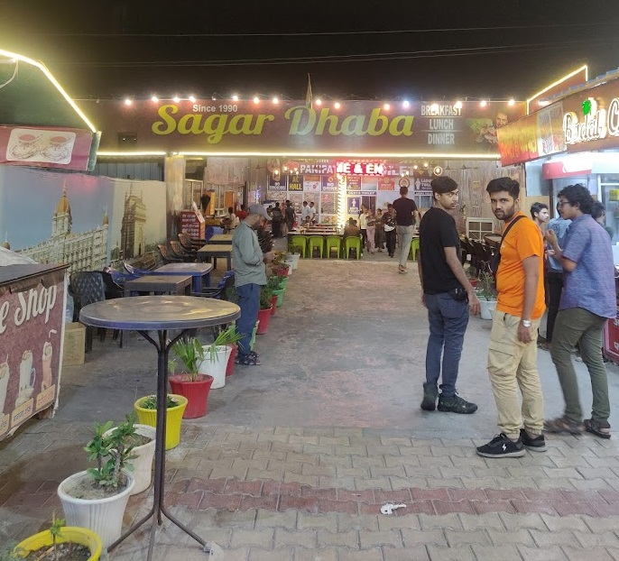

After a thirty-hour-long hectic journey, I did not expect to be greeted by rain and puddles in what they called heaven on earth. After all, if I wanted my clothes ruined in drizzling rain, I could take a walk out on a rainy day right out of my home. However, after having a cup of tea from a store, I stepped out onto a busy alley in Pahalgam, Kashmir -- and the sky cleared to greet me like that. It finally kicked in. I was truly there! But not so fast. Time for a rewind...

## Dhaka

With the term break of 3-2 underway, eight of my classmates and I were ready to embark on our next journey. I had only recently been to Manali. As it turns out, I couldn't simply get enough of mountains. It was my decision that our next trip would be to Kashmir.

To us Bangladeshis, the image of Kashmir (especially those who have never been to) is like a magical land in the mountains. Kashmir is deemed as "Bhushorgo" (heaven on earth) in Bangla, and that was exactly the word that my parents used to describe the place. I knew I HAD to visit it at least once in my life. And what better time than in university -- with my favourite people -- to set foot there?

On a fine Sunday morning, we started for Kolkata from Dhaka Cantonment Railway Station. Moitree Express promised a departure and arrival time of 8 am and 4 pm. They managed to keep both ends of the promise. The journey was fairly mundane, with a few highlights. We encountered an ingratiating (?) individual scratching the back of an immigration officer for no apparent reason. And of course, it's impossible to miss the bulldogs that the BSF brings to each cabin. Immigration was very hectic and lethargic at Kolkata.

## Kolkata

With all proceedings complete, we managed to leave Chitpur Railway Station at around 5:30 PM local time. There is a local taxi service right in front of the station, where we hired two taxis -- heading towards Marquis Street. We were all very tired in the taxi, but clearly there was excitement. Personally, it was somewhat comforting to revisit Kolkata. The pale yellow sun setting behind the skyline, its rays reflecting on the white and yellow Ambassador taxis, the aged, yet gleaming edifices, the older-than-time-itself public transport buses which seemed to be holding on for dear life oozed off a vibe that was missing in Dhaka. Yet, Kolkata welcomes an observer's eyes with glamor and charm -- with the high rise buildings, the dazzling business districts, music and uproars diffusing out of bars and nightclubs. It is always an all-in-all experience, yet, it never feels overwhelming to the senses.

Marquis Street was nothing short of a living organism. Known for its affordable hotels and nightstays, and being adjacent to Kolkata New Market, Marquis Street is a popular name among Bangladeshi travellers. Likewise, we decided to set up camp there for the night. Even though we did not arrive with a very meticulous plan, we knew we could not afford to slack as our flight for Delhi was scheduled at 8 AM the next morning. Some of us had even earlier flights, as they were late to confirm their trip. I knew I would have to give up on the many delicacies of life that Marquis Street had to offer. After all, *OH bad for CNS*.

## Delhi

Seemed like we had somehow forgotten it was May.

I could tell you about the details of our mundane journey from Kolkata to Delhi, but I choose not to. We had split into two groups come Day 2. Our Indigo flight reached Delhi airport by noon. Delhi airport was a major step up from Kolkata. There was a passage from the airport to a metro station, and another led to a taxi stand. These passages were air-conditioned, more or less (this is important). For most of us, it was not our first trip to Delhi, and thus we had already toured the local spots and devoured the exquisite cuisine that Delhi, particularly old Delhi has to offer. We had to find a way to kill time till dusk, for our bus towards Jammu awaited then from Lal Qila bus stand. Just as we stepped out of the air-conditioned passages pondering on the possibility of refreshing our memories with Delhi's offerings, reality struck us ablaze.

I had never felt such terrible heat. Sunlight seemed to prick a thousand pins on the skin. The air felt like something coming out of a pizza oven going berserk. Surrendering to the sun and moving back to the airport remained the only viable option, and we made sure to do exactly that. We found shelter in a Wow Momo shop inside the airport premises, where we had our breakfast.

A few of us had the sudden urge to shop for shoes. We set off for Connaught Place for the airport in an Uber. A noteworthy proportion of the Delhi landscape encountered during the journey portrayed backward districts and slums, until Connaught Place, in its full glory, came into sight. It emanated British heritage vibes through its architecture, and modern bling through the opulent Nike, Adidas, Hugo Boss, Tommy Hilfiger and a plethora of other brand stores. The pavements were lined with Delhi's famous lime soda drinks -- something unmissable in the dog days in Delhi. Lunch was served to us at a local McDonald's. It was my first visit to a McDonald's, and I was surprised by how economic and generous the servings were.

We regrouped at Lal Qila bus stand before dusk. Our sleeper coach bus awaited, and started for Jammu a good fifteen minutes late. The sleeper cabins could accomodate two. It was comfortable enough. At around midnight, we stopped at a Punjabi dhaba in Haryana, where we had a taste of what was to be our staple food for the coming days. Punjabi dhabas in that part of the country mostly served stuff like *roti*, *dal tadka*, and rice. The recipe was vastly different from its Bengali counterparts, and I knew it would take some time getting used to. After a thirty-minute break at the restaurant, our bus started off for Jammu. The premium suspensions and the well-built highways ensured a decent night's sleep.

