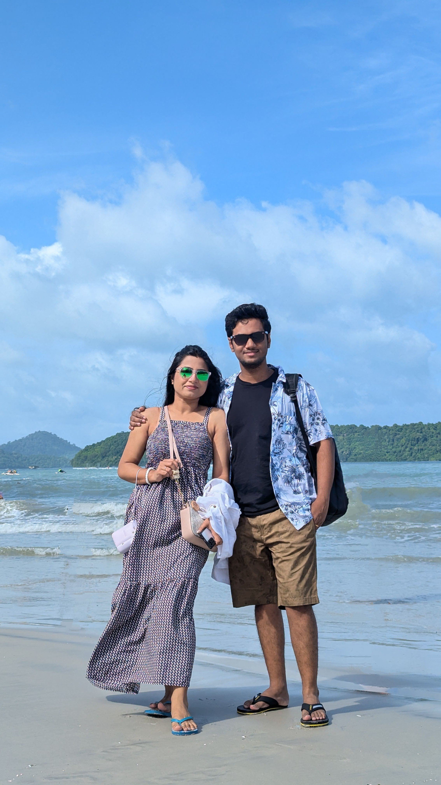

The best trip of my life is officially over. 

And what didn't it have! Starting from the absolutely delicious multi-cuisine food, to the jaw dropping views, and the captivating experiences -- I had all I could ask for in seven days. To top things off, the trip couldn't be with anyone better -- than the love of my life.

It feels nice to write this blog. It has only been about a month -- the rush has faded, life has settled, and now it's time to make congeal my memories.

# Day 1

Our trip to the jewel of the east started rather awkwardly. Our US Bangla flight was (un)fortunately delayed by four hours. I remember my travel agent, Mr Manoj calling me at the dead of the morning at 1:30. Great news it seemed, as I had little sleep from having to go through my travel checklist unncessarily -- I always lack confidence in my ability to arrange things without hiccups.